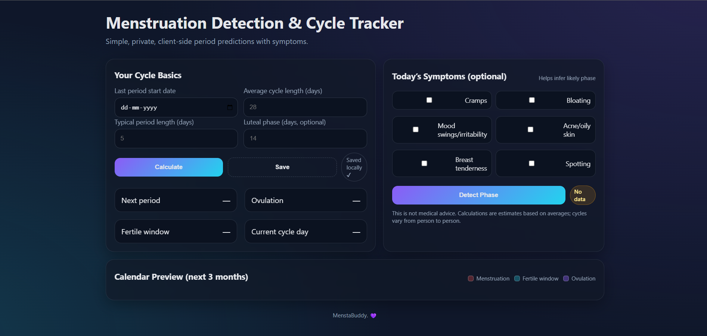
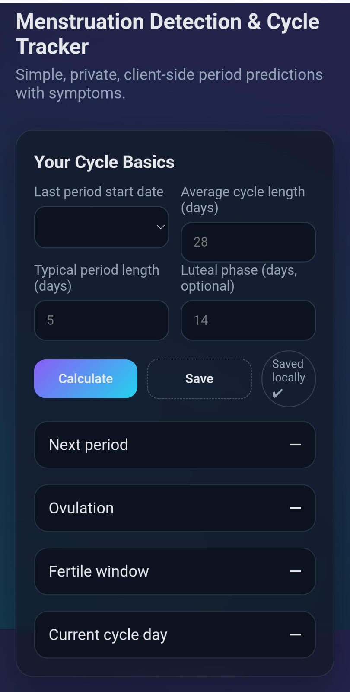

# 🌸 Menstruation Tracker (MenstaBuddy)

A responsive and lightweight **Menstruation Cycle Tracker** built with **HTML, CSS, and JavaScript**.  
This app helps users **track cycles, predict upcoming periods, and manage records** with a simple and clean UI.  

---

## 🚀 Live Demo  
🔗 [View Project](https://aastha4502.github.io/menstruation-tracker/)  

---

## 📸 Screenshots  

<p align="center">
  
  
</p>

✨ Left side shows the **desktop view** and right side shows the **mobile-friendly view** of *MenstaBuddy*.


## ✨ Features
✅ Track menstruation start & end dates  
✅ Calculate average cycle length  
✅ Predict next cycle dates  
✅ Responsive for mobile & desktop  
✅ Clean and user-friendly interface  

---

## 🛠️ Tech Stack
- 🌐 **Frontend:** HTML, CSS, JavaScript  
- 🚀 **Deployment:** GitHub Pages  

---


---

## 📌 Installation & Usage
To run the project locally:  

```bash
# Clone the repository
git clone https://github.com/aastha4502/menstruation-tracker.git

# Open project folder
cd menstruation-tracker

# Open index.html in browser
